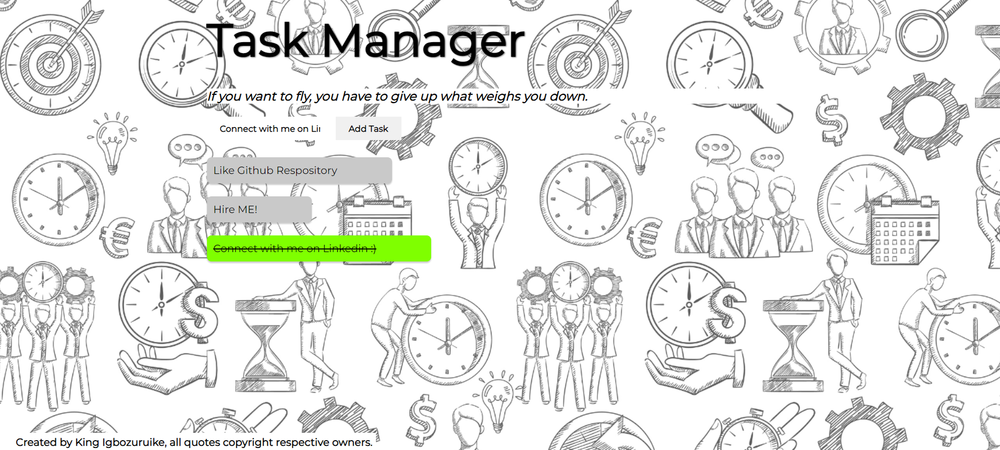

# taskmanagementsystem

Task Management System is a simple web application that allows users to manage their tasks/to-dos, letting them mark off completed tasks, delete uneccesary tasks and motivational quotes to keep them going.

## Technologies Used

- HTML
- CSS
- JavaScript
- Google Fonts (Montserrat)

## Features

- Input bar to let user enter task
- Creates a clickable bar containing the task the user can click when complete.
- Stylish interface with doodle image as background to create an appealing environment.

## How to Use

1. Clone this repository to your local machine.
2. Open the `index.html` file in your web browser.
3. Enter your task and click on add task.
4. Click on delete beside your task if you want to delete it.
5. Click on task to mark as done.

## Credits

- Font: [Montserrat](https://fonts.google.com/specimen/Montserrat) from Google Fonts.
- Background image: [freepik](https://freepik.com).

## Note

All quotes are copyright respective owners.

## License

This project is licensed under the MIT License. See the [LICENSE](https://opensource.org/license/mit/) file for details.

---